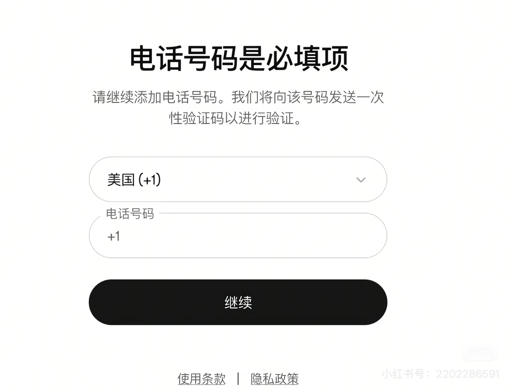
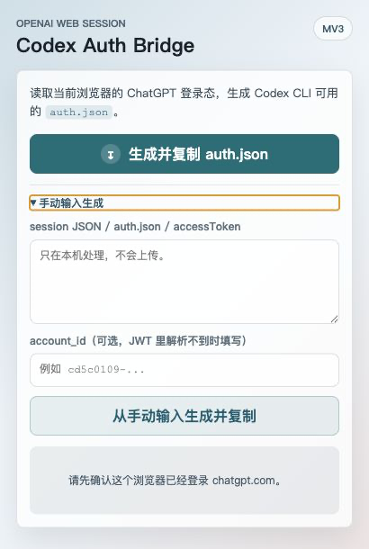

# Codex Auth Bridge

一个用于从已登录的 ChatGPT 网页会话生成 Codex CLI `auth.json` 的 Chrome / Edge 扩展。

> 这个项目不会保存、上传或中转你的登录态。扩展只在本地浏览器里请求 `chatgpt.com/api/auth/session`，并把生成的 `auth.json` 写入剪贴板。

## 问题背景

部分用户直接登录 Codex 时，会遇到电话号码验证流程，导致登录过程卡住或无法继续。



这个扩展的思路是复用浏览器里已经登录成功的 ChatGPT 网页会话，生成 Codex CLI 可识别的登录配置。

## 插件效果

在浏览器已经登录 ChatGPT 的前提下，点击扩展按钮即可生成并复制 `auth.json`。



## 目录结构

```text
.
├── extension/          # 浏览器插件源码，加载扩展时选择这个目录
│   ├── manifest.json
│   ├── popup.html
│   ├── popup.js
│   ├── styles.css
│   └── auth_bridge.js
├── imgs/               # README 截图资源
├── .gitignore
└── README.md
```

## 功能

- 读取当前浏览器里的 `chatgpt.com` 登录态
- 提取 OpenAI 网页会话中的 `accessToken`
- 自动解析 `account_id` 和 token 过期时间
- 生成 Codex CLI 可使用的 `auth.json`
- 一键复制到剪贴板，并提供敏感内容预览

## 安装

1. 下载或克隆本仓库。
2. 打开 Chrome / Edge 的扩展管理页。
3. 开启“开发者模式”。
4. 点击“加载已解压的扩展程序”。
5. 选择本仓库下的 `extension/` 目录。

## 使用

1. 先在同一个浏览器里登录 [chatgpt.com](https://chatgpt.com/)。
2. 点击浏览器工具栏里的 **Codex Auth Bridge** 图标。
3. 点击“生成并复制 auth.json”。
4. 将剪贴板内容覆盖到本机 Codex 配置文件：

```text
~/.codex/auth.json
```

Windows 通常对应：

```text
%USERPROFILE%\.codex\auth.json
```

## 权限说明

扩展只声明了两个必要权限：

- `https://chatgpt.com/*`：用于请求 ChatGPT 当前登录会话。
- `clipboardWrite`：用于把生成的 `auth.json` 写入剪贴板。

## 安全提示

`auth.json` 包含可用于访问账号的敏感 token。请不要把生成结果截图、发给他人或提交到公开仓库。token 过期后，重新打开扩展生成一次即可。

## 开发

本项目是一个 Manifest V3 浏览器扩展，无需构建步骤。主要文件都位于 `extension/` 目录：

- `extension/manifest.json`：扩展清单与权限声明
- `extension/popup.html`：扩展弹窗结构
- `extension/styles.css`：弹窗样式
- `extension/auth_bridge.js`：登录态读取和 `auth.json` 生成逻辑
- `extension/popup.js`：弹窗交互、复制和状态展示

修改后在扩展管理页点击“重新加载”即可测试。
